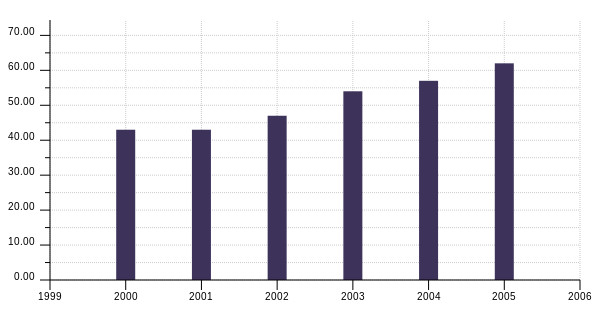
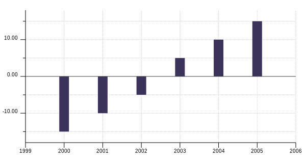

# Introduction to kixi.lapita

## Content
* [Project background](#project-background)
* [Documentation](#documentation)
  * [`kixi.lapita` namespace](#kixilapita-namespace)
    * [Dependencies for kixi.lapita](#dependencies-for-kixilapita)
	* [I/O related functions](#io-related-functions): [`write-csv!`](#write-csv) | [`csv-to-maps-coll`](#csv-to-maps-coll) | [`csv-to-dataset`](#csv-to-dataset)
	* [Data preview functions](#data-preview-functions): [`info`](#info) | [`head`](#head)
	* [Data transformation functions](#data-transformation-functions): [`count-elements-in-column`](#count-elements-in-column)
  * [`kixi.lapita.plot` namespace](#kixilapitaplot-namespace)
    * [Dependencies for kixi.lapita.plot](#dependencies-for-kixilapitaplot)
	* [Plotting function](#plotting-function): [`plot-bar-chart`](#plot-bar-chart)
* [Future improvements](#future-improvements)
  * [Organise namespaces](#organise-namespaces)
  * [Improve current features](#improve-current-features)
  * [Add new features](#add-new-features)
* [Try `kixi.lapita`](#try-kixilapita)

## Project background
When it comes to data analysis (manipulating datasets and plotting data) we have no set tool at Mastodon C.
A lot of people tend to use R or sometimes Python. But as we're all proficient in Clojure, it makes sense for us to use this language.

We haven't identified a Clojure library that would suit our needs except for Incanter. And we are worried that Incanter is not fully maintained anymore.
Therefore instead of maintaining a rather large code base, we wish to create our own small library to use internally and to be used by other Clojurians.

This project was started in early 2017 in parallel with a client's project that would have been a good use case for it.
But so far due to time constraint, only basic capabilities have been added to `kixi.lapita`.

## Documentation
At the moment there are functions to manipulate data in the namespace [kixi.lapita](https://github.com/MastodonC/kixi.lapita/blob/master/src/kixi/lapita.clj), and there are functions to plot data in the namespace [kixi.lapita.plot](https://github.com/MastodonC/kixi.lapita/blob/master/src/kixi/lapita/plot.clj).
The third namespace [kixi.lapita.schemas](https://github.com/MastodonC/kixi.lapita/blob/master/src/kixi/lapita/schemas.clj) is used within `kixi.lapita` namespace.

### `kixi.lapita` namespace

#### Dependencies for `kixi.lapita`
* The expected file format is comma-separated values (CSV) that we handle using the library [clojure.data.csv](https://github.com/clojure/data.csv).
* We use the Clojure I/O library [clojure.java.io](https://clojure.github.io/clojure/clojure.java.io-api.html).
* Despite the recent popularity of [clojure.spec](https://clojure.org/news/2016/05/23/introducing-clojure-spec) we are currently using schema coercion with `schema.coerce` from [plumatic/schema](https://github.com/plumatic/schema).
* We currently prioritise working with [`core.matrix`](https://github.com/mikera/core.matrix) data structures over classic Clojure data structures (like collections of maps). For that we use [clojure.core.matrix](https://github.com/mikera/core.matrix/blob/develop/src/main/clojure/clojure/core/matrix.cljc) and [clojure.core.matrix.dataset](https://github.com/mikera/core.matrix/blob/develop/src/main/clojure/clojure/core/matrix/dataset.clj).
* To manipulate core.matrix datasets, on top of the functions available in the library we use functions from [`witan.datasets`](https://github.com/MastodonC/witan.workspace-api/blob/master/src/witan/datasets.clj) developed at Mastodon C.

#### I/O related functions
##### `write-csv!`
Write data to file
```Clojure
> (write-csv! test-dataset "test-file.csv")
```
##### `csv-to-maps-coll`
Read data as Clojure data structure
```Clojure
> (csv-to-maps-coll "test-file.csv")

({:col-1 "1", :col-2 "a", :col-3 "1.1"}
 {:col-1 "2", :col-2 "b", :col-3 "1.2"}
 {:col-1 "3", :col-2 "c", :col-3 "1.3"})
```
##### `csv-to-dataset`
Read data as a `core.matrix` dataset.

This function can be used without schema coercion or with schema coercion.
When schema coercion fails it returns a data structure containing the error message(s). This means that it's easy to miss the coercion fail and work with broken data.
Here we try to give more flexibility and allow to continue working on the data whether it coerces or not, while being aware of when the coercion failed.
When used with a schema, the default behaviour is to return the whole data where whatever passed the coercion is coerced and the rest is still in its initial state.
There are options to see the error message, to write the uncoerced data to a file, or to return the coerce data without the uncoerced data.

 * Without schema coercion
```Clojure
> (csv-to-dataset "test-file.csv")

| :col-1 | :col-2 | :col-3 |
|--------+--------+--------|
|      1 |      a |    1.1 |
|      2 |      b |    1.2 |
|      3 |      c |    1.3 |

```
 * With schema coercion and options
```Clojure
> (use '[schema.core :as s])
nil
> (use '[schema-contrib.core :as c])
nil

> (def TestData1
    {:col-1 s/Int
     :col-2 java.lang.Double
     :col-3 s/Str
     :col-4 c/Date})
#'kixi.lapita/TestData1

> (csv-to-dataset "test-data/test-data-1.csv"
                  TestData1
                  {:print-errors true
                   :write-errors "test-data/errors.csv"
                   :remove-errors false})

There are 0 rows with data coercion errors out of 7 rows
The records with data coercion issues were saved in test-data/errors.csv

| :col-1 | :col-2 | :col-3 |     :col-4 |
|--------+--------+--------+------------|
|      1 |    1.1 |    foo | 2017-02-01 |
|      2 |    1.2 |    bar | 2017-02-02 |
|      3 |    1.3 |    baz | 2017-02-03 |
|      4 |    1.4 |   fizz | 2017-02-04 |
|      5 |    1.5 |   buzz | 2017-02-05 |
|      6 |    1.6 |    boo | 2017-02-06 |
|      7 |    1.7 |    wiz | 2017-02-07 |
```

#### Data preview functions
##### `info`
Provides information on the data.

This function returns a map containing the columns names, the number of columns and the number of rows.
```Clojure
> (info test-ds)

{:column-names [:col-1 :col-2 :col-3], :num-rows 3, :num-columns 3}
```
##### `head`
Have a pick at the data.

Like in R or Python/Pandas, it can be useful while working on data to regularly check the transformations work by have a look at a small part of the dataset.
Here the default is to return the first five rows, but the number of rows to be returned can be customised.
```Clojure
> (head test-ds 1)

| :col-1 | :col-2 | :col-3 |
|--------+--------+--------|
|      1 |      a |    1.1 |
```

#### Data transformation functions
##### `count-elements-in-column`
This function isn't particularly well named, but it's role is for a given column to count the number of items for each type of items in this column.
It takes in a dataset and outputs a new dataset with the specified column name and a count column.
```Clojure
> other-test-ds

| :col-1 | :col-2 | :col-3 |
|--------+--------+--------|
|      1 |      a |    1.1 |
|      2 |      b |    1.2 |
|      3 |      a |    1.3 |
|      4 |      c |    1.4 |
|      5 |      b |    1.5 |
|      6 |      a |    1.6 |

> (count-elements-in-column other-test-ds :col-2 :occurences-col-2)

| :col-2 | :occurences-col-2 |
|--------+-------------------|
|      a |                 3 |
|      b |                 2 |
|      c |                 1 |
```

### `kixi.lapita.plot` namespace
#### Dependencies for `kixi.lapita.plot`
To create plots we wanted to use a sub-library within the [thi.ng](http://thi.ng/) project as they are powerful and flexible.
Here [`thi.ng/geom`](https://github.com/thi-ng/geom) is better suited for the purpose of creating plots. It is a plotting library that gives us tools to create plotting tools, but it doesn't come ready out of the box.

#### Plotting function
##### `plot-bar-chart`
This function creates a vertical bar chart.

It expects data as a core.matrix dataset, columns names for the x-axis values and the y-axis values and the name for the resulting plot file.
There are additional optional options to customise the colour, the width and height of the plot.
```Clojure
> test-data

| :col-1 | :col-2 |
|--------+--------|
|   2000 |     43 |
|   2001 |     47 |
|   2002 |     62 |
|   2003 |     43 |
|   2004 |     54 |
|   2005 |     57 |

> (plot-bar-chart test-data :col-1 :col-2 "test-plot")
nil
```

```Clojure
> test-data-2

| :col-1 | :col-2 |
|--------+--------|
|   2000 |    -15 |
|   2001 |    -10 |
|   2002 |     -5 |
|   2003 |      5 |
|   2004 |     10 |
|   2005 |     15 |

> (plot-bar-chart test-data-2 :col-1 :col-2 "test-plot-2")
nil
```


## Future improvements
The library being very basic for now there are a lot of improvements to expect.
The list of improvements currently lives in the backlog of the project's [Waffle board](#https://waffle.io/MastodonC/kixi.lapita). Those populate the [issues](https://github.com/mastodonc/kixi.lapita/issues) of the github repo. So more feature ideas or fixes can be added to either of those pages.

### Organise namespaces
Note: The tasks associated should be under the [`refactor` label](https://github.com/MastodonC/kixi.lapita/labels/refactor) on Github/Waffle.

This is aimed at splitting the `kixi.lapita` namespace into several namespaces based on the role of the functions.
The namespace is currently divided in three part using comments. Each part would become a new namesapce:
* `kixi.lapita.io` namespace would contain all the functions to read/write files
* `kixi.lapita.preview` namespace would contain all the functions to get easily get information on the content of the data
* `kixi.lapita.transform` namespace would contain all the functions to transform data

This reorganisation of the repository is captured in this [issue #3](https://github.com/MastodonC/kixi.lapita/issues/3).

### Improve current features
Note: The tasks associated should be under the [`improve-feature`](https://github.com/MastodonC/kixi.lapita/labels/improve-feature) label on Github/Waffle.

* `kixi.lapita.plot`
The immediate next step will be to improve on the vertical bar chart starting by enabling the user to plot multiple data series. [See issue #24](https://github.com/MastodonC/kixi.lapita/issues/24)

* `kixi.lapita.io`
The function `csv-to-dataset` is quite slow when doing a schema validation especially when trying to identify errors in the schema validation process. An effort has been started to optimise that process on the branch [`experiment/perf-improvements`](https://github.com/MastodonC/kixi.lapita/tree/experiment/perf-improvements). [See issue #13](https://github.com/MastodonC/kixi.lapita/issues/13)

* `kixi.lapita.preview`
The `info` function is missing some functionality. It will ultimately return a pretty print of the information and return extra information like the type of data for each column of the data structure. [See issue #1](https://github.com/MastodonC/kixi.lapita/issues/1)

### Add new features
Note: The tasks associated should be under the [`new-feature`](https://github.com/MastodonC/kixi.lapita/labels/new-feature) label on Github/Waffle.

* `kixi.lapita.plot`
New types of plots are needed like histograms, scatter/line plot or even horizontal bar chart.

* `kixi.lapita.preview`
To keep the `info` function as a helper function only (to get an overview of it), the functionality of getting column names and the number of columns/rows should be returned by external functions (like in R or Python/Pandas). [See issue #26](https://github.com/MastodonC/kixi.lapita/issues/26)

There's a `describe` function in this part of the code. It's currently non functional, but it should ultimately return information on the values within the numeric columns. See the description of [issue #2](https://github.com/MastodonC/kixi.lapita/issues/2) for more details on the outomce of this function. The `maximum` and `minimum` functions (taken from another repository) are supposed to be called by `describe`. Those are functions to use with transducers, meaning they would be working on Clojure data structures but not core.matrix dataset. The decision to use transducers is for the function to be fast even on large sets of data. However it still needs to be determined how this would work with core.matrix.datasets.

* `kixi.lapita.transform`
The users should be able to delete data, so a `delete` or `drop` function should be added. [See issue #23](https://github.com/MastodonC/kixi.lapita/issues/23)

Another basic functionality is being able to group data. This [issue #21](https://github.com/MastodonC/kixi.lapita/issues/21) is actually to add in a very useful fn from another library: [`gather-by-year`](https://github.com/MastodonC/witan.phyrexian/blob/master/src/witan/phyrexian/utils.clj#L105). This is very useful transformation when each year is a column name of a dataset and one want to have a column called "year" with each year as a value of that column.

* general changes
We currently do not use [clojure.spec](https://clojure.org/news/2016/05/23/introducing-clojure-spec) but it has been advised as a efficient way to validate the functions arguments. [See issue #19](https://github.com/MastodonC/kixi.lapita/issues/19)

The aim of this library is to be used on both core.matrix datasets and Clojure data structure. There are add ins for the current functions of new functions to write to make that possible. [See issue #7](https://github.com/MastodonC/kixi.lapita/issues/7)

## Try `kixi.lapita`
At the moment `kixi.lapita` hasn't been released on Clojars, yet. So in order to use it, you'll need to have a local copy of the [github repository](https://github.com/MastodonC/kixi.lapita/tree/master).

Once you have cloned the project, you can either:
* have a go from your repl within `kixi.lapita project`, or
* work from a separate project and use `kixi.lapita` as a dependency:
1) from your terminal go to `kixi.lapita` directory and run `$ lein compile`
2) create a new Clojure project and add `[kixi.lapita "0.1.0-SNAPSHOT"]` to your dependencies in your `project.clj`.
